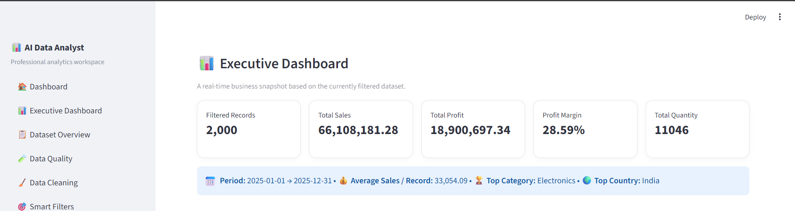
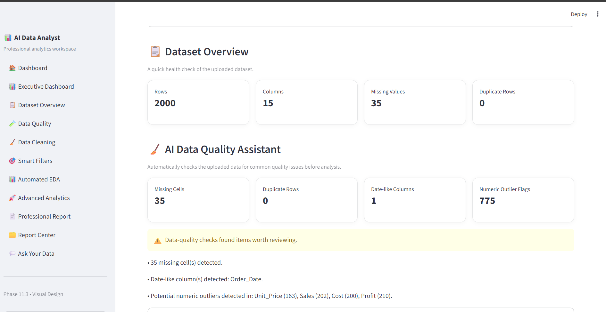
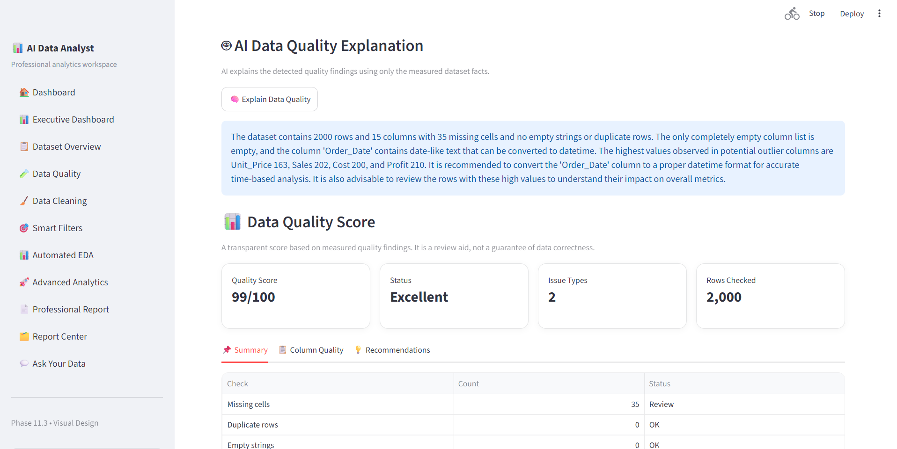
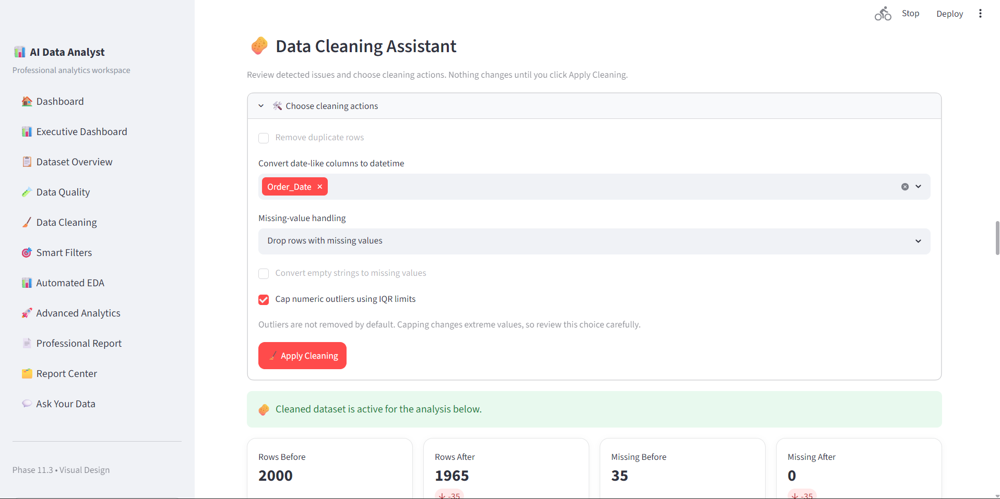
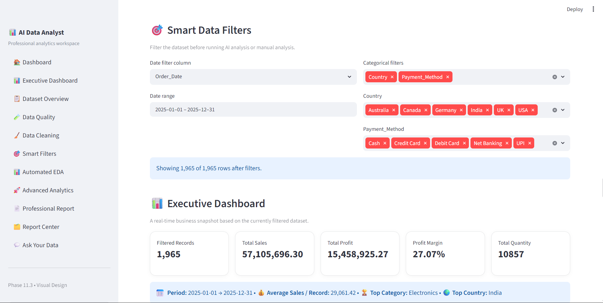
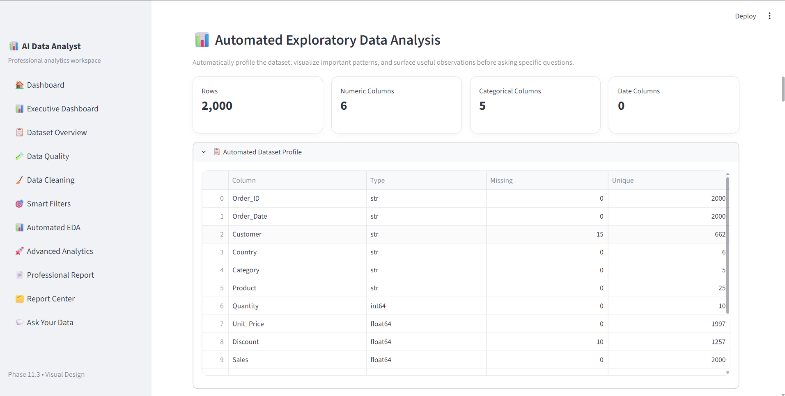
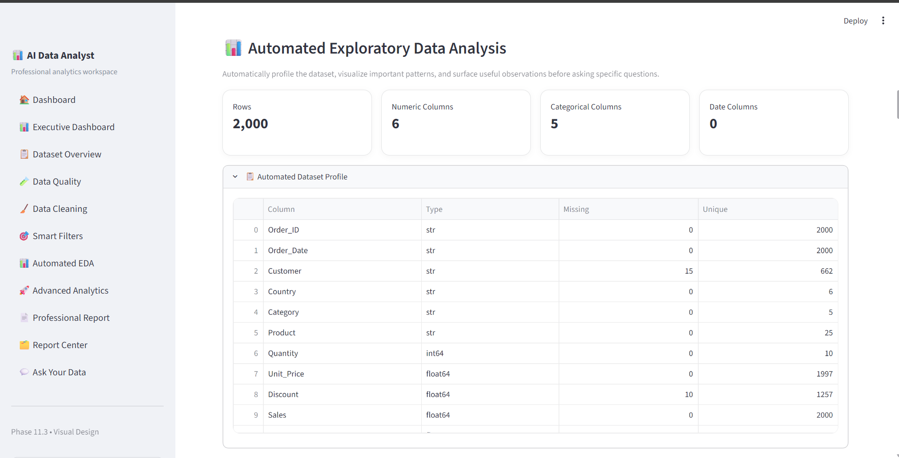
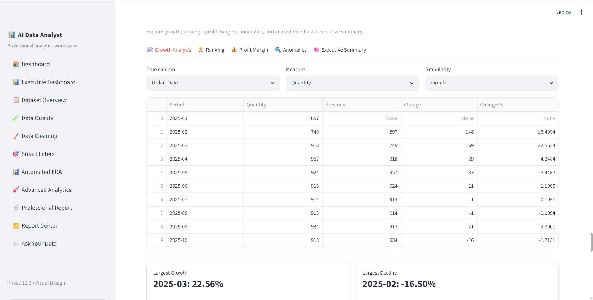
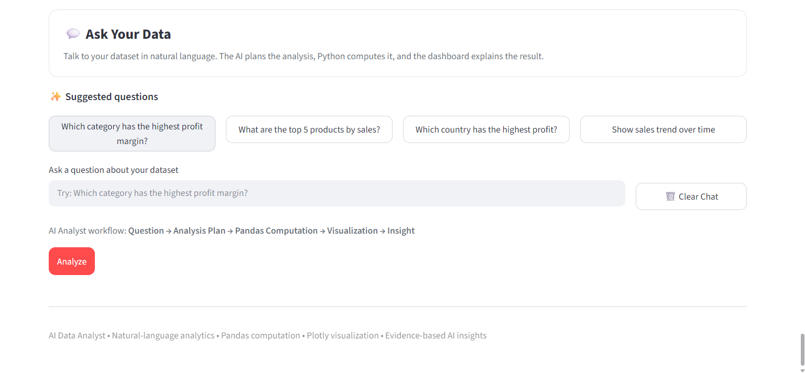
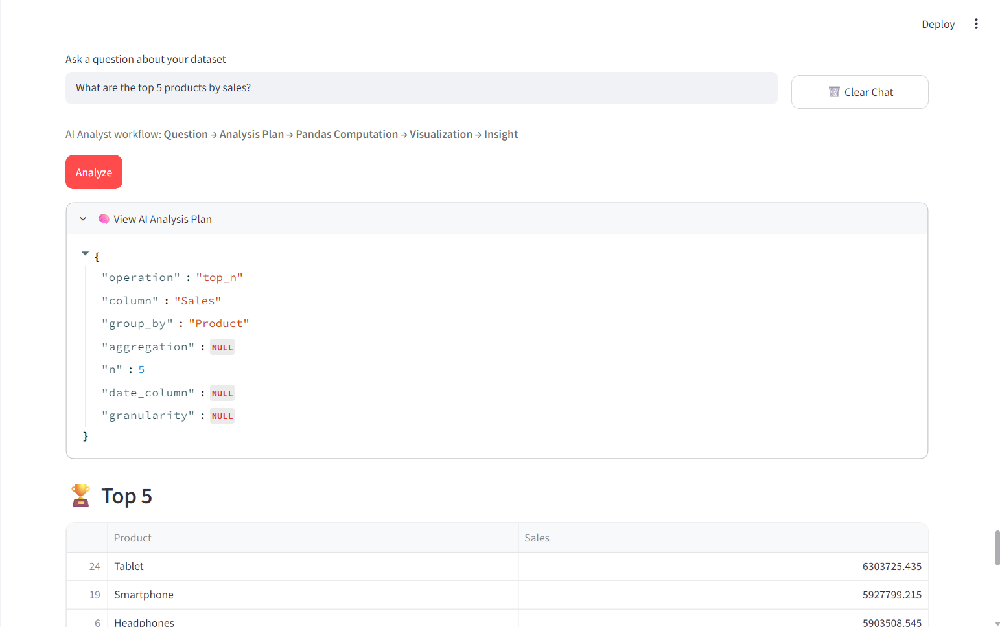

\# 🤖 AI Data Analyst – Natural Language Data Analysis Platform


An AI-powered data analysis platform that allows users to upload CSV datasets and analyze their data using natural language.


Instead of manually writing Python or SQL queries, users can ask questions such as:


- What is the total sales?

- What are the top 5 products by sales?

- What are the total sales by country?

- Which month had the highest sales?

- What is the relationship between sales and profit?


The platform uses a Large Language Model to understand the user's question, converts it into a structured analysis plan, performs the actual computation using Pandas, generates interactive Plotly visualizations, and provides AI-powered business insights.


--


 1. 🚀 Project Overview


The \*\*AI Data Analyst\*\* is designed as a natural-language interface for data analytics.


The main objective is to combine:


- Artificial Intelligence

- Data Analysis

- Data Cleaning

- Exploratory Data Analysis

- Data Visualization

- Business Intelligence

- Automated Reporting


into a single analytics platform.


The application allows users to move from raw CSV data to actionable insights through an easy-to-use dashboard.


---


2. 🎯 Project Objectives


The main objectives of this project are:


1. Allow users to upload CSV datasets.

2. Support analysis of multiple CSV files.

3. Automatically profile datasets.

4. Identify data-quality issues.

5. Provide data-cleaning functionality.

6. Allow users to ask questions using natural language.

7. Convert natural-language questions into structured analysis plans.

8. Perform numerical calculations using Pandas.

9. Generate interactive visualizations using Plotly.

10. Generate AI-powered business insights.

11\. Provide conversational follow-up analysis.

12\. Perform automated exploratory data analysis.

13\. Provide advanced analytics.

14\. Generate professional PDF reports.

15\. Support containerized execution using Docker.


\---


\# 3. ✨ Key Features


\## 3.1 📊 Executive Dashboard


The Executive Dashboard provides a high-level view of the uploaded dataset.


It includes:


\- Total rows

\- Numeric columns

\- Categorical columns

\- Date columns

\- Dataset-level statistics

\- Business-oriented analytical summaries


\---


\## 3.2 📁 CSV Upload


Users can upload CSV datasets directly into the application.


The platform supports:


\- CSV file upload

\- Large datasets

\- Multiple CSV files

\- Automatic dataset profiling

\- Source-file tracking


When multiple datasets are uploaded, the application can combine them for analysis.


\---


\## 3.3 📂 Multi-File Analysis


The application supports analysis across multiple CSV files.


Each uploaded dataset can be associated with its source file.


This allows users to work with multiple related datasets in a single analytical workspace.


\---


\## 3.4 🔎 Data Quality Assistant


The Data Quality Assistant identifies common data-quality issues.


It analyzes:


\- Missing values

\- Duplicate records

\- Data types

\- Unique values

\- Dataset structure

\- Potential data-quality problems


This helps users understand the condition of their data before performing analysis.


\---


\## 3.5 🧹 Data Cleaning Assistant


The Data Cleaning Assistant provides functionality for preparing datasets for analysis.


It helps users identify and address common issues such as:


\- Missing values

\- Duplicate records

\- Data-type problems

\- Potential outliers

\- Other data-quality concerns


\---


\## 3.6 🎯 Smart Filters


Users can filter their dataset before performing analysis.


Filtering capabilities include:


\- Categorical filters

\- Numeric filters

\- Date-based filters

\- Multiple filter conditions


This allows users to perform analysis on specific subsets of their data.


\---


\## 3.7 🤖 Natural Language Data Analysis


Users can ask questions about their dataset using normal language.


For example:


```text

What is the total sales?

```


```text

What are the top 5 products by sales?

```


```text

What are the total sales by country?

```


```text

Show sales trend over time.

```


The platform interprets the question and converts it into a structured analysis plan.


\---


\## 3.8 🧠 AI Question Planner


The AI Question Planner converts natural-language questions into structured JSON analysis plans.


For example:


```text

User Question:


What are the top 5 products by sales?

```


The AI can produce a structured plan such as:


```json

{

&#x20; "operation": "top\_n",

&#x20; "column": "Sales",

&#x20; "group\_by": "Product",

&#x20; "aggregation": null,

&#x20; "n": 5,

&#x20; "date\_column": null,

&#x20; "granularity": null

}

```


The structured plan is then passed to the analysis engine.


This separates AI-based question understanding from numerical computation.


\---


\# 4. 🧠 AI Analysis Workflow


The platform follows the workflow below:


```mermaid

flowchart TD

&#x20;   A\[User] --> B\[CSV Upload]

&#x20;   B --> C\[Data Quality]

&#x20;   C --> D\[Data Cleaning]

&#x20;   D --> E\[Smart Filters]

&#x20;   E --> F\[Natural Language Question]

&#x20;   F --> G\[Groq LLM]

&#x20;   G --> H\[Structured Analysis Plan]

&#x20;   H --> I\[Pandas Analysis Engine]

&#x20;   I --> J\[Plotly Visualization]

&#x20;   J --> K\[AI Business Insight]

&#x20;   K --> L\[Professional PDF Report]

```


The core analytical workflow is:


```text

Natural Language Question

&#x20;         ↓

&#x20;      Groq LLM

&#x20;         ↓

&#x20;Structured JSON Plan

&#x20;         ↓

&#x20;   Pandas Engine

&#x20;         ↓

&#x20;Actual Calculation

&#x20;         ↓

&#x20;   Plotly Chart

&#x20;         ↓

&#x20;  AI Explanation

&#x20;         ↓

&#x20;    PDF Report

```


\---


\# 5. 🐼 Pandas Analysis Engine


The application uses Pandas for the actual data computation.


The supported analysis operations include:


1\. Total

2\. Average

3\. Minimum

4\. Maximum

5\. Count

6\. Unique Count

7\. Group By

8\. Top N

9\. Bottom N

10\. Correlation

11\. Date Trend


The LLM does not directly calculate the final numerical result.


Instead:


```text

User Question

&#x20;     ↓

AI Analysis Plan

&#x20;     ↓

Pandas Computation

&#x20;     ↓

Actual Result

```


This architecture helps reduce the risk of unsupported or invented numerical answers.


\---


\# 6. 📈 Interactive Data Visualization


The platform uses \*\*Plotly\*\* for interactive data visualization.


Depending on the analysis, the application can generate visualizations such as:


\- Bar charts

\- Line charts

\- Scatter plots

\- Histograms

\- Correlation visualizations

\- Time-series charts


The visualization is generated from the computed analytical result.


\---


\# 7. 💡 AI Business Insights


After the numerical analysis is completed, the platform can generate an AI-powered business insight.


The AI is instructed to:


1\. Use only information supported by the analysis result.

2\. Avoid inventing causes.

3\. Avoid unsupported assumptions.

4\. Mention important differences when applicable.

5\. Mention highest and lowest values when applicable.

6\. Clearly identify recommendations as recommendations.

7\. Keep the insight concise.


Example:


```text

The total sales amount to $66,108,181.28.

This figure represents the overall revenue generated

during the period analyzed.

```


The AI insight is generated from the calculated result rather than replacing the calculation itself.


\---


\# 8. 💬 Conversational AI


The application supports conversational data analysis.


Users can continue asking follow-up questions about the dataset.


For example:


```text

User:

What is the total sales?


AI:

The total sales are ...


User:

What are the top 5 countries?


AI:

...

```


This creates a more natural analytical experience compared with repeatedly configuring charts manually.


\---


\# 9. 📅 Date and Time Analysis


The application supports date-oriented analytical questions.


Examples include:


```text

Show sales trend over time.

```


```text

What were the total sales each month?

```


```text

Show profit by year.

```


```text

Show sales by quarter.

```


```text

Show weekly sales.

```


```text

Show sales by date.

```


Supported time granularities include:


\- Day

\- Week

\- Month

\- Quarter

\- Year


\---


\# 10. 📊 Automated EDA


The Automated EDA module automatically explores uploaded datasets.


It can provide information about:


\- Dataset structure

\- Numeric columns

\- Categorical columns

\- Missing values

\- Unique values

\- Statistical characteristics

\- Distributions

\- Correlations

\- Important patterns


This provides an initial understanding of the dataset before detailed analysis.


\---


\# 11. 📈 Advanced Analytics


The Advanced Analytics module provides additional analytical capabilities for deeper exploration of datasets.


It allows users to move beyond basic summaries and explore more detailed analytical patterns.


The goal is to provide a broader analytics workspace instead of limiting the application to simple aggregations.


\---


\# 12. 📄 Professional PDF Reports


The application can generate professional PDF analysis reports.


Reports can contain:


\- Dataset information

\- Analytical results

\- Business insights

\- Visual analysis

\- Summary information


This allows analytical results to be saved and shared outside the application.


\---


\# 13. 🗂️ Report Center


The Report Center provides a dedicated area for generated analytical reports.


It helps users manage and access report outputs created during analysis.


\---


\# 14. 🛠️ Technology Stack


| Technology | Purpose |

|---|---|

| Python | Core programming language |

| Streamlit | Web application framework |

| Pandas | Data analysis and computation |

| NumPy | Numerical operations |

| Plotly | Interactive data visualization |

| Groq | Large Language Model integration |

| python-dotenv | Environment variable management |

| ReportLab | PDF report generation |

| Scikit-learn | Analytics and machine learning utilities |

| OpenPyXL | Excel-related data handling |

| Docker | Application containerization |

| Docker Compose | Container configuration |

| Git | Version control |

| GitHub | Source code hosting |


\---


\# 15. 🏗️ System Architecture


The complete application architecture can be represented as:


```text

&#x20;                        ┌─────────────────────┐

&#x20;                        │        USER         │

&#x20;                        └──────────┬──────────┘

&#x20;                                   │

&#x20;                                   ▼

&#x20;                        ┌─────────────────────┐

&#x20;                        │     CSV UPLOAD      │

&#x20;                        │   Multiple Files    │

&#x20;                        └──────────┬──────────┘

&#x20;                                   │

&#x20;                                   ▼

&#x20;                        ┌─────────────────────┐

&#x20;                        │   DATA QUALITY      │

&#x20;                        │    \& CLEANING       │

&#x20;                        └──────────┬──────────┘

&#x20;                                   │

&#x20;                                   ▼

&#x20;                        ┌─────────────────────┐

&#x20;                        │    SMART FILTERS    │

&#x20;                        └──────────┬──────────┘

&#x20;                                   │

&#x20;                                   ▼

&#x20;                        ┌─────────────────────┐

&#x20;                        │ NATURAL LANGUAGE    │

&#x20;                        │     QUESTION        │

&#x20;                        └──────────┬──────────┘

&#x20;                                   │

&#x20;                                   ▼

&#x20;                        ┌─────────────────────┐

&#x20;                        │      GROQ LLM       │

&#x20;                        │  QUESTION PLANNER   │

&#x20;                        └──────────┬──────────┘

&#x20;                                   │

&#x20;                                   ▼

&#x20;                        ┌─────────────────────┐

&#x20;                        │ STRUCTURED ANALYSIS │

&#x20;                        │        PLAN         │

&#x20;                        └──────────┬──────────┘

&#x20;                                   │

&#x20;                                   ▼

&#x20;                        ┌─────────────────────┐

&#x20;                        │  PANDAS ANALYSIS    │

&#x20;                        │       ENGINE        │

&#x20;                        └──────────┬──────────┘

&#x20;                                   │

&#x20;                                   ▼

&#x20;                        ┌─────────────────────┐

&#x20;                        │ PLOTLY VISUALIZATION│

&#x20;                        └──────────┬──────────┘

&#x20;                                   │

&#x20;                                   ▼

&#x20;                        ┌─────────────────────┐

&#x20;                        │   AI BUSINESS       │

&#x20;                        │      INSIGHTS       │

&#x20;                        └──────────┬──────────┘

&#x20;                                   │

&#x20;                                   ▼

&#x20;                        ┌─────────────────────┐

&#x20;                        │   PDF REPORT        │

&#x20;                        └─────────────────────┘

```


\---


\# 16. 📂 Project Structure


```text

AI-Data-Analyst/

│

├── app.py

├── ai\_engine.py

├── test\_ai.py

│

├── requirements.txt

│

├── Dockerfile

├── docker-compose.yml

├── .dockerignore

│

├── .gitignore

├── .env.example

├── .env

│

└── README.md

```


\### Important


The `.env` file is used locally for the API key and is \*\*not committed to GitHub\*\*.


The `.env.example` file contains only a safe placeholder.


\---


\# 17. ⚙️ Local Installation


\## 17.1 Clone the Repository


```bash

git clone https://github.com/RahulRathod2003/AI-Data-Analyst.git

```


\## 17.2 Open the Project


```bash

cd AI-Data-Analyst

```


\## 17.3 Create a Virtual Environment


Windows:


```cmd

python -m venv venv

```


\## 17.4 Activate the Virtual Environment


```cmd

venv\\Scripts\\activate

```


\## 17.5 Install Dependencies


```cmd

pip install -r requirements.txt

```


\---


\# 18. 🔐 Environment Configuration


Create a `.env` file in the project root.


Add:


```text

GROQ\_API\_KEY=your\_groq\_api\_key\_here

```


Replace the placeholder with your own Groq API key.


The application loads the API key from the environment.


The API key should never be written directly inside Python source code.


The repository contains:


```text

.env.example

```


as a safe configuration template.


\---


\# 19. ▶️ Run the Application


After installing the dependencies and configuring the API key, run:


```cmd

streamlit run app.py

```


The application will normally open at:


```text

http://localhost:8501

```


\---


\# 20. 🐳 Docker Installation


The project includes Docker support for containerized execution.


\## 20.1 Build the Docker Image


```cmd

docker build -t ai-data-analyst .

```


\## 20.2 Run the Docker Container


```cmd

docker run -d --name ai-data-analyst -p 8501:8501 --env-file .env ai-data-analyst

```


The application can then be accessed at:


```text

http://localhost:8501

```


\---


\# 21. 🐳 Docker Compose


The project also includes a Docker Compose configuration.


Start the application:


```cmd

docker compose up -d

```


Check the container:


```cmd

docker compose ps

```


Stop the application:


```cmd

docker compose down

```


\---


\# 22. 🔒 Security


Security is an important part of the project.


The actual API key is stored locally in:


```text

.env

```


The `.env` file is excluded from Git using `.gitignore`.


The repository also excludes:


```text

venv/

\_\_pycache\_\_/

\*.pyc

.env

```


The Docker configuration also excludes sensitive and unnecessary local files using `.dockerignore`.


The Docker application runs using a non-root application user.


A container health check is also configured to monitor application availability.


\---


\# 23. 🧪 Example Questions


Users can ask questions such as:


\### Basic Analysis


```text

What is the total sales?

```


```text

What is the average sales?

```


```text

What is the minimum profit?

```


```text

What is the maximum profit?

```


\### Group Analysis


```text

What are the total sales by country?

```


```text

What is the average sales by category?

```


\### Ranking


```text

What are the top 5 products by sales?

```


```text

What are the bottom 5 products by sales?

```


\### Relationship Analysis


```text

What is the relationship between sales and profit?

```


\### Time Analysis


```text

Show sales trend over time.

```


```text

What were the total sales each month?

```


```text

Show profit by year.

```


```text

Show sales by quarter.

```


```text

Show weekly sales.

```


```text

Show sales by date.

```


\---


\# 24. 🔄 Example AI Workflow


Example question:


```text

What are the total sales by country?

```


The system processes the question as follows:


```text

1\. User enters the question

&#x20;               ↓

2\. Groq understands the question

&#x20;               ↓

3\. AI creates a structured analysis plan

&#x20;               ↓

4\. Pandas receives the plan

&#x20;               ↓

5\. Pandas calculates sales by country

&#x20;               ↓

6\. Plotly creates a visualization

&#x20;               ↓

7\. AI generates a business insight

```


This creates a complete end-to-end AI analytics workflow.


\---


\# 25. 📸 Screenshots


Screenshots of the application can be added to this section as the project portfolio is expanded.


Recommended screenshots include:


1\. Executive Dashboard

2\. Dataset Overview

3\. Data Quality

4\. Data Cleaning

5\. Smart Filters

6\. Automated EDA

7\. Advanced Analytics

8\. Ask Your Data

9\. AI Analysis Result

10\. Professional Report

11\. Report Center


Example:


```markdown

!\[Executive Dashboard](screenshots/executive-dashboard.png)

```


\---


\# 26. 📊 Sample Dataset


The application can be tested using sales datasets containing fields such as:


```text

Order\_ID

Order\_Date

Customer

Country

Category

Product

Quantity

Unit\_Price

Discount

Sales

Profit

```


The application automatically profiles the uploaded dataset and identifies available columns and data types.


\---


\# 27. 🧩 Testing


The project includes:


```text

test\_ai.py

```


which can be used to test AI-related functionality.


Run:


```cmd

python test\_ai.py

```


\---


\# 28. 📌 Important Design Principle


A key design principle of this project is:


```text

LLM = Understand the question

Pandas = Perform the calculation

Plotly = Visualize the result

LLM = Explain the result

```


The LLM is therefore used as an intelligent interface and reasoning layer rather than as the source of numerical calculations.


\---


\# 29. 🚀 Future Enhancements


Potential future improvements include:


1\. React + Vite frontend

2\. FastAPI backend

3\. User authentication

4\. Database connectivity

5\. SQL database analysis

6\. Excel file support

7\. Cloud deployment

8\. Advanced statistical analysis

9\. Machine learning-based insights

10\. Role-based dashboards

11\. Enterprise data connectors

12\. More advanced AI agents

13\. Automated data pipelines

14\. Additional visualization types


\---


\# 30. 🎓 Skills Demonstrated


This project demonstrates practical experience with:


\### Programming


\- Python

\- Object-oriented programming

\- Modular application development


\### Data Analytics


\- Pandas

\- NumPy

\- Data Cleaning

\- Exploratory Data Analysis

\- Statistical analysis

\- Data profiling


\### Data Visualization


\- Plotly

\- Interactive dashboards

\- Analytical charts

\- KPI visualization


\### Artificial Intelligence


\- Large Language Models

\- Natural Language Processing

\- Structured JSON generation

\- AI-powered data analysis

\- AI business insights

\- Conversational analytics


\### Application Development


\- Streamlit

\- User interfaces

\- File uploads

\- Interactive workflows

\- Report generation


\### DevOps


\- Docker

\- Docker Compose

\- Container health checks

\- Non-root containers

\- Environment variable management


\### Version Control


\- Git

\- GitHub

\- GitHub Push Protection

\- Secure secret management


\---


\# 31. 💼 Portfolio Value


This project demonstrates the ability to build an end-to-end AI and data analytics application rather than only performing isolated data analysis tasks.


It combines:


```text

Data Engineering

&#x20;      +

Data Analytics

&#x20;      +

Artificial Intelligence

&#x20;      +

Data Visualization

&#x20;      +

Business Intelligence

&#x20;      +

Application Development

&#x20;      +

Docker

&#x20;      +

Git/GitHub

```


This makes the project suitable as a portfolio project for roles related to:


\- Data Analyst

\- Junior Data Analyst

\- Python Developer

\- AI/ML Engineer

\- Generative AI Engineer

\- Data Science

\- Business Intelligence

\- Software Engineering


\---


\# 32. 👨‍💻 Author


\## Rahul Rathod


B.Tech – Electronics \& Communication Engineering


Interested in:


\- Data Analytics

\- Python Development

\- Artificial Intelligence

\- Machine Learning

\- Generative AI

\- Software Development


\---


\# 33. ⭐ GitHub Repository


GitHub Repository:


https://github.com/RahulRathod2003/AI-Data-Analyst


If you find this project useful or interesting, consider giving the repository a ⭐ star.


\---


\# 34. 📜 License


This project is currently provided for educational and portfolio purposes.


A formal open-source license can be added in a future version if required.

## 10. Application Screenshots

The application provides an end-to-end analytics workspace for exploring, cleaning, visualizing, and analyzing datasets.

### 10.1 Main Dashboard



### 10.2 Executive Dashboard



### 10.3 Dataset Overview



### 10.4 Data Quality Assistant



### 10.5 Data Cleaning



### 10.6 Smart Data Filters



### 10.7 Automated EDA



### 10.8 Advanced Analytics



### 10.9 Ask Your Data



### 10.10 AI Analysis Result

